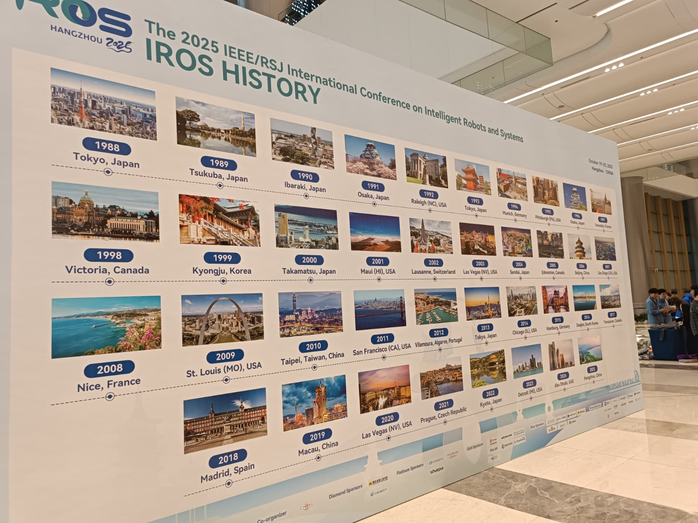
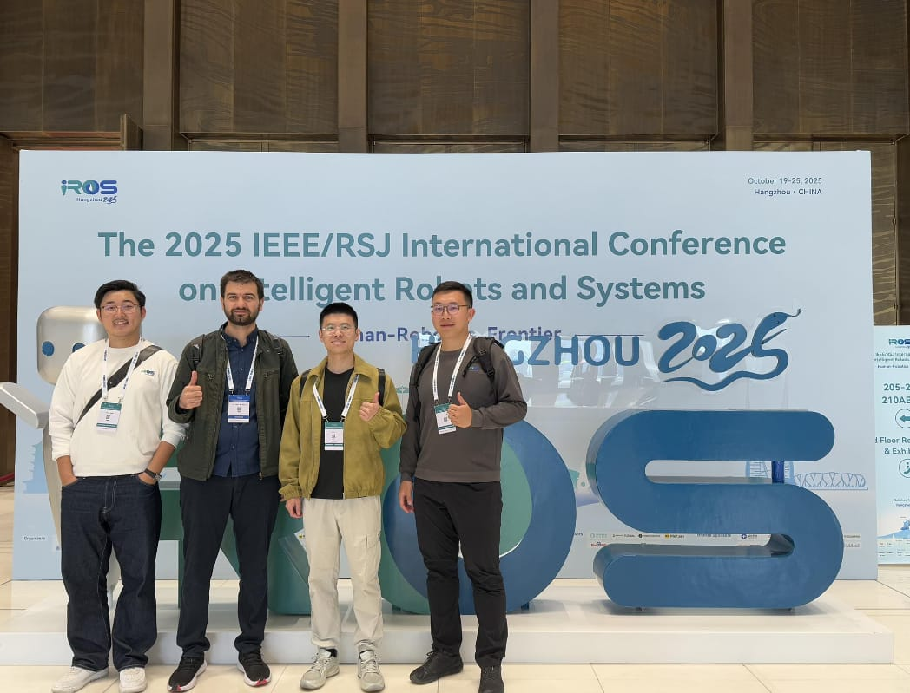
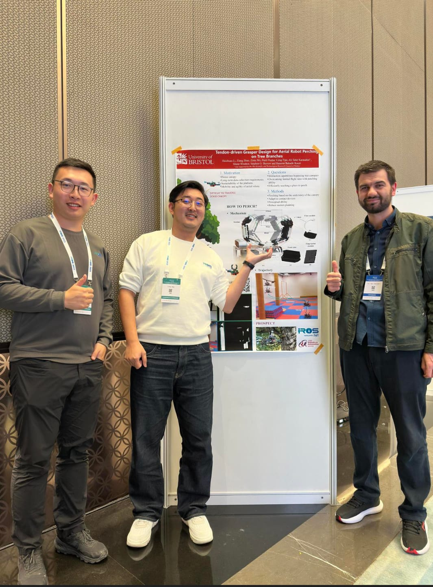
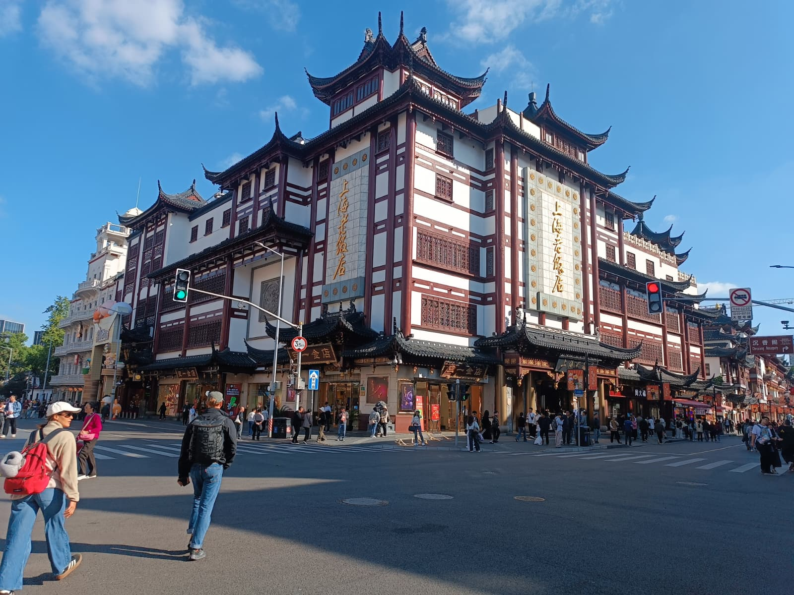
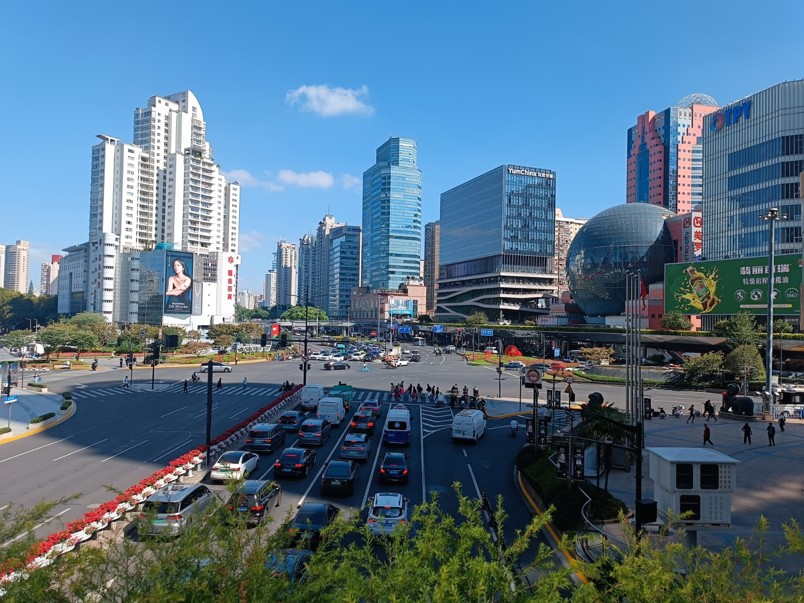
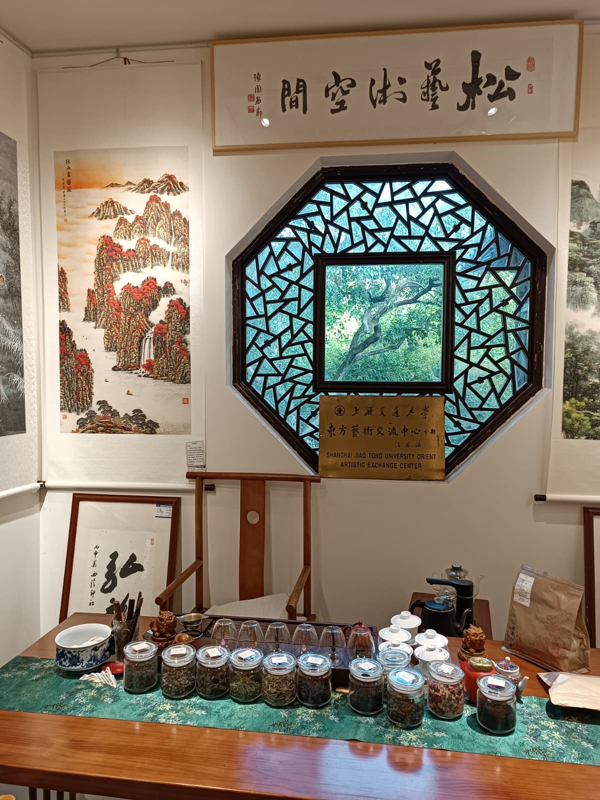

Hayat boyu unutulmayacak deneyimler listesine yeni bir halka eklendi: İlk defa adım attığım Çin topraklarında, dünyanın en prestijli robotik konferanslarından biri olan **IROS 2025**'e katıldım. Hangzhou ve Şanghay şehirlerini kapsayan bu seyahat, hem akademik vizyonum hem de kültürel birikimim için dönüm noktalarından biri oldu.

**Akademik Durak: Hangzhou ve IROS 2025**

IROS'un köklü tarihini yansıtan "IROS History" duvarı önünde durduğumda, bu devasa organizasyonun bir parçası olmanın gururunu bir kez daha hissettim. 1988'de Tokyo'da başlayan bu yolculuğun, 2025 yılında Hangzhou'da devam eden serüvenine dahil olmak paha biçilemezdi.

<figure style="text-align: center;">
  
  <figcaption>1988'den günümüze robotik dünyasının kalbi: IROS Tarihçesi </figcaption>
</figure>

Konferans kapsamında, Bristol Üniversitesi **Aerial Robotics Group** ekibi olarak yerimizi aldık. Bilimsel tartışmalar ve teknolojik ağ kurma açısından oldukça verimli bir hafta geçirdik.

<figure style="text-align: center;">
  
  <figcaption>IROS 2025 ekibimizle konferans merkezinde </figcaption>
</figure>

**Sunum Heyecanı ve Ekip İle Poster Soru-Cevap Seansı**

Konferansın benim için en unutulmaz ve yoğun anları şüphesiz sunum ve poster oturumlarıydı. Ekibimizle birlikte hazırladığımız **"Tendon-driven Grasper Design for Aerial Robot Perching on Tree Branches"** başlıklı çalışmamızın sunumunu gerçekleştirdikten sonra, heyecanımız poster alanında da devam etti. 

Sunumun ardından ekip arkadaşlarımızla birlikte posterimizin başında yerimizi aldık. Dünyanın farklı üniversitelerinden gelen araştırmacıların teknik sorularını yanıtladığımız, tasarımımızın detaylarını tartıştığımız ve otonom sistemlerin doğadan ilham alan tutunma mekanizmaları üzerine derinlemesine fikir alışverişi yaptığımız bu soru-cevap seansı oldukça besleyiciydi. Ekip olarak soruları göğüslemek ve çalışmamızı bu denli profesyonel bir platformda savunmak akademik motivasyonumuzu katladı.

> **Çalışmamızı detaylı incelemek isterseniz:** > [IEEE Xplore: Tendon-driven Grasper Design for Aerial Robot Perching on Tree Branches](https://ieeexplore.ieee.org/abstract/document/11247040)

<figure style="text-align: center;">
  
  <figcaption>Sunum sonrası ekip ile poster başındaki dinamik soru-cevap seansımız </figcaption>
</figure>

Konferansın sergi alanında (Exhibition) ise robotik endüstrisinin devlerini yakından tanıma şansı bulduk. Özellikle "Deep Robotics" standındaki robotik sistemler, teoride tartıştığımız birçok konunun pratikteki devasa karşılığını gösteriyordu.

<figure style="text-align: center;">
  
  <figcaption>Teknolojinin ulaştığı son nokta: Derin robotik ve otonom sistemler </figcaption>
</figure>

**Kültürel Keşif: Şanghay ve Geleneksel Çay Seremonisi**

Hangzhou'daki yoğun akademik programın ardından rotamızı Şanghay'a kırdık. Şanghay, gökyüzüne uzanan modern gökdelenleri ile geleneksel Çin mimarisinin iç içe geçtiği muazzam bir kontrast sunuyor.

<figure style="text-align: center;">
  
  <figcaption>Geleneksel mimarinin Şanghay sokaklarındaki ihtişamı </figcaption>
</figure>

Modern Şanghay'ın dinamik yapısı, kalabalık caddeleri ve teknolojik gelişmişliği şehrin her köşesinde hissediliyor.

<figure style="text-align: center;">
  
  <figcaption>Modern Şanghay'ın bitmek bilmeyen enerjisi </figcaption>
</figure>

Bu hızlı tempoya Şanghay Jiao Tong Üniversitesi bünyesindeki sanatsal değişim merkezinde kısa bir mola verdik. Katıldığımız geleneksel çay seremonisi, kaligrafi eserleri ve huzurlu ortamıyla Çin kültürünün derinliklerine yaptığımız yolculuğu taçlandırdı.

<figure style="text-align: center;">
  
  <figcaption>Zamanın durduğu anlar: Geleneksel Çin çay seremonisi </figcaption>
</figure>

**Sonuç**

İlk Çin ziyaretim, sadece teknik bir sunum değil; sunum sonrası yapılan o derin soru-cevap seanslarından Şanghay'ın mistik çay evlerine kadar uzanan bütünsel bir deneyimdi. Kendi çalışmalarımızı küresel arenada savunmak ve robotik topluluğuyla bu seviyede etkileşime girmek, gelecek hedeflerimiz için eşsiz bir rehber oldu.

Yeni serüvenlerde buluşmak ümidiyle, sağlıcakla kalınız.
