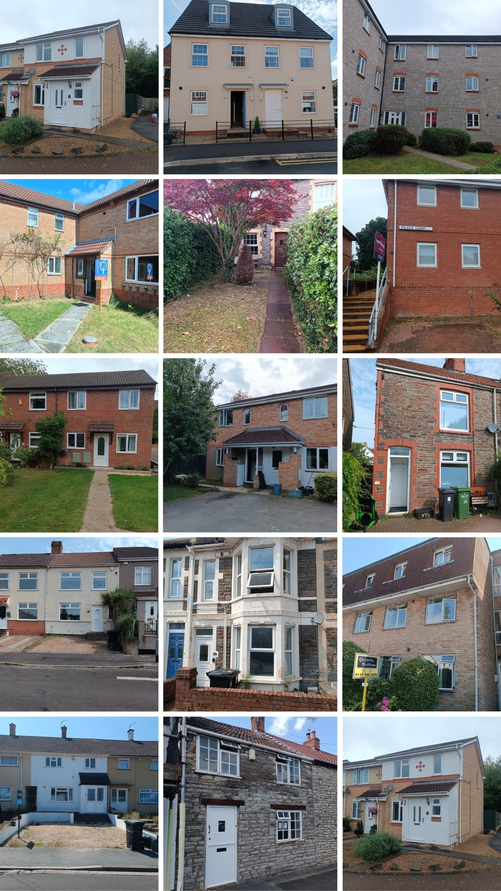
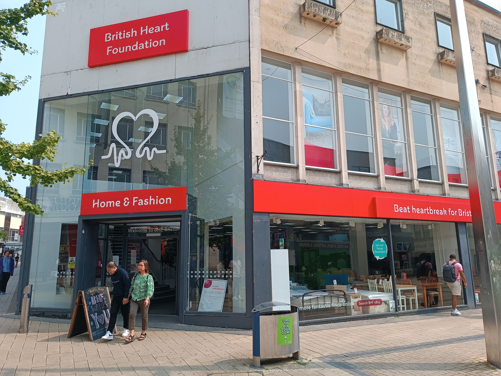
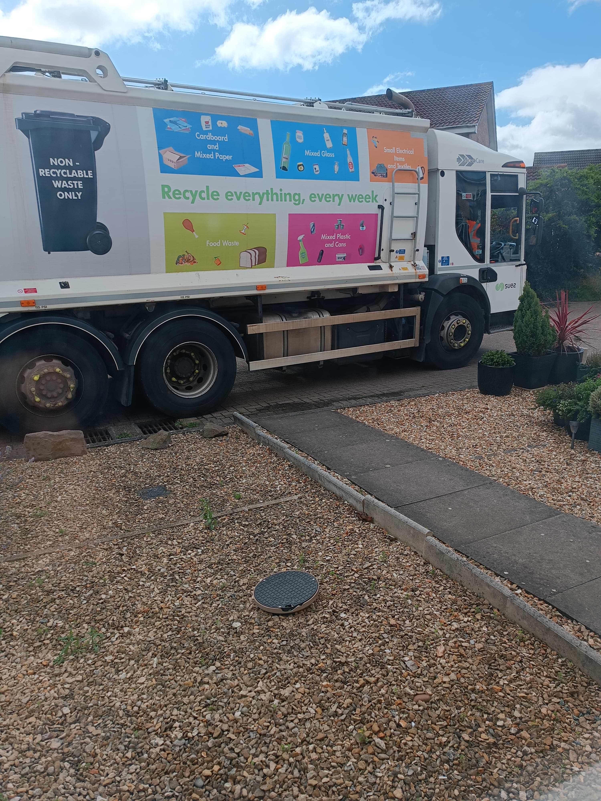
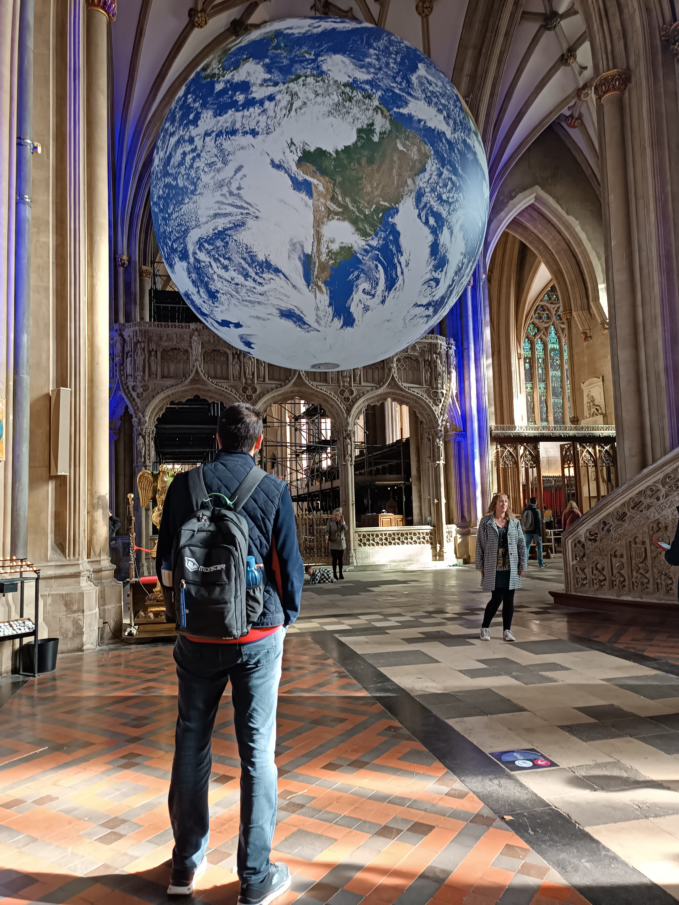
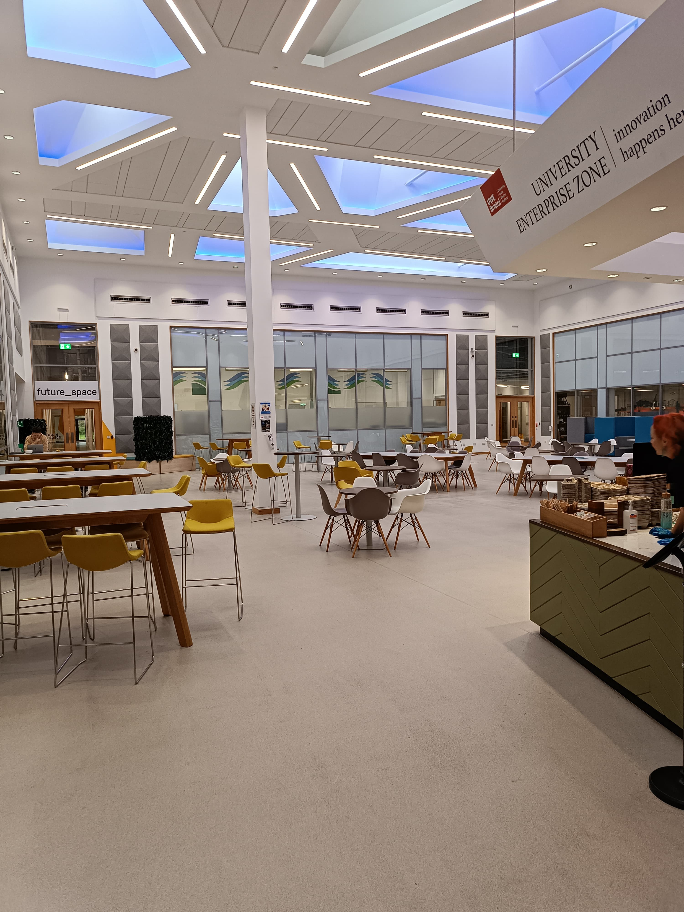
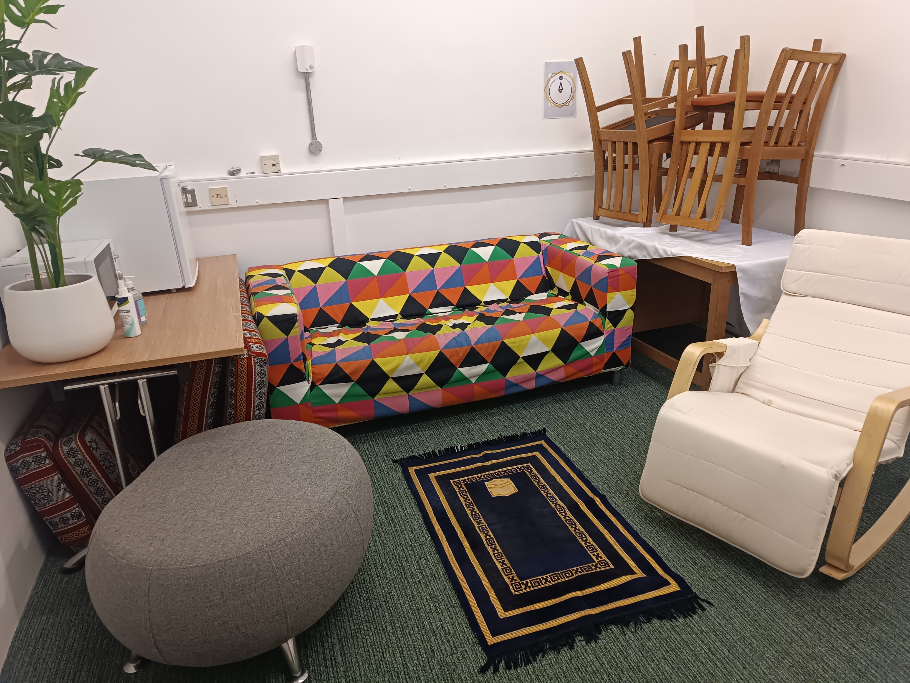
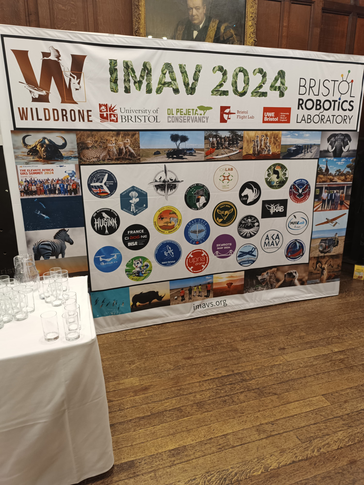
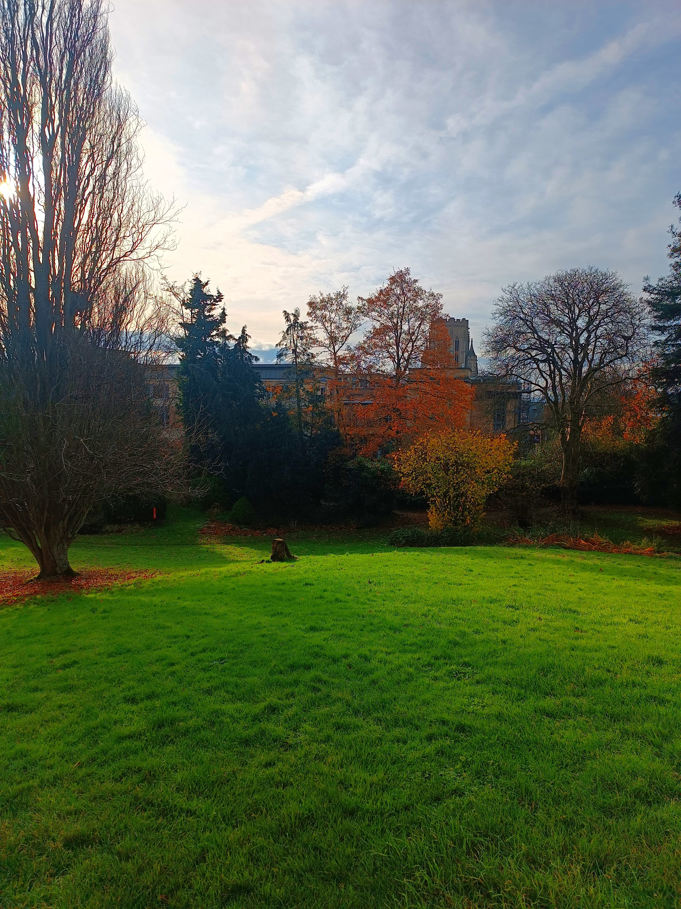

Öncelikle 12 ay süreyle doktora sonrası araştırma [TÜBİTAK 2219] amaçlı İngiltere'de bulunacağım süre boyunca, bizzat yaşadıklarımı aktarmak amacıyla bu yazı serisine başlamış bulunmaktayım. Hem geleceğe bir not hem de benzer niyetler içerisinde olan/olacaklara kendi penceremizden bir bakış açısı sunmak istedim. Başlamadan önce bu fırsatı, araştırma projemizi destekleyerek bize veren TÜBİTAK'a ve bu sürece izin veren üniversiteme teşekkür etmek isterim.

**İlk İzlenimler: İngiltere’ye Merhaba**

Microsoft'un [CrowdStrike](https://www.bbc.co.uk/news/articles/cpe3zgznwjno) güncellemesiyle beraber 8.5 Milyon cihazın etkilenmesiyle, 22 Temmuz 2024 tarihindeki uçuşumun ertelenmesiyle İngiltere süreci başlamış oldu.

Bristol şehri İngiltere'nin güney batısında yer almaktadır. İngiltere'nin [en büyük altıncı şehri](https://worldpopulationreview.com/cities/united-kingdom) ve araştırmalarımı yapacağım Bristol Üniversitesi 2025 [THE verilerine göre](https://www.timeshighereducation.com/world-university-rankings/university-bristol) UK'daki 9, dünya sıralamasında ise 78'nci sırada yer almaktadır. 

İlk etapta çözülmesi/halledilmesi gereken konaklamayla ilgilendiğim bir sürecin içerisinde kendimi buldum. Bristol şehri, hem havacılık ve savunma teknoloji şirketlerinin etkisi hem de şehirde iki üniversite bulunması nedeniyle göç almaktadır. Bu durumda konaklama işini oldukça zorlaştırdığını söyleyebilirim. Aşağıdaki resim kiralamak için görüşmeye gittiklerim evlerden oluşmaktadır.

<figure style="text-align: center;">
  
  <figcaption>Çok şükür şu an birisindeyiz</figcaption>
</figure>

23 Temmuz'da başladığım ev arama süreci 3 Eylül tarihinde kira sözleşmesini imzalamakla tamamlanmış oldu. Özellikle İngiltere'ye gelecekler için şehrin dinamiklerini önceden öğrenmeleri ve ona göre konaklama stratejileri geliştirmelerini şiddetle tavsiye ederim. Evimizi [rightmove](https://www.rightmove.co.uk/) üzerinden bir emlak ajansı aracılığıyla kiraladık.

İlk izlenimlere değinmek gerekirse; farklı bir ülke ve farklı bir sistemin içerisine girmenin vermiş olduğu çeşitlilik sizde kaldığını söyleyebilirim. Gerçekten bazı olayları değerlendirebilmek için alternatiflerini de görmeniz gerektiği kanaatindeyim. Bu deneyimlere bundan daha fazla anlam yüklemenin uygun olduğunu düşünmüyorum.

**Günlük Yaşam**

Genel itibariyle sakin ve hayatın akışına bırakıldığı bir süreçte olduğumu rahatlıkla söyleyebilirim. Londra gibi yoğun ilgi gören yerde değilseniz ve kullandığınız ulaşım tercihine de bağlı olarak işlerin olması gibi ilerlediği belirtilebilir. 

Başka bir ülkede yeni bir hayat kurmanın aslında çok zor geçmediğini söyleyebilirim. Özellikle sistem içerisinde buna yönelik araçlar varsa.. Kiraladığımız evin ihtiyaçları için ürünleri satın aldığımız vakıfta bunlardan birisiydi.

<figure style="text-align: center;">
  
  <figcaption>Ücreti mukabilinde ürünler kapında</figcaption>
</figure>

İkinci el eşyaları elde çıkarmak bir mesele olduğu için bunları sistem içerisinde ve sürdürebilir bir şekilde tutmanın yollarından birisi olarak insanlar tercih etmektedir. Fazla eşyayı atamıyorsunuz çünkü dışarıda bırakacak bir yer yok. Çöpleriniz haftanın belirli bir günü aşağıdaki araçlar ile ve size ait olan kutular içerisinde toplanmaktadır.

<figure style="text-align: center;">
  
  <figcaption>Ayrıştırma işi sizde</figcaption>
</figure>

Belediye bu ve benzer hizmetlerinden dolayı "[council tax](https://www.bristol.gov.uk/residents/council-tax/charges-and-bands)" kapsamında evinizin durumuna (oda sayısı ve tipine) göre aylık ortalama £200-250 ödemeye hazır olun. 

Toplu ulaşımın önceliklendirildiğini birçok noktadaki özel şeritler ve durakların buna göre planlanmasından anlayabiliyorsunuz. Bristol şehrinden Londra'ya otobüsle 4 kişilik bir aile £58 ücret ödeyecekken trenle bu fiyatın £203 olması anlam veremediğim konulardan birisi olmuştur.

Başka bir konu da konaklama bedellerinin çok yüksel olmasıdır. Bir evi kiralayabilmek için aylık kiranın en az 2.5 katı gelirinizin olduğunu belgelemek durumundasınız. Bu şartı sağlayamamanız durumunda UK'da bulunan bir garantör aracılığyla bu sürece devam etmeniz gerecektir. 

Alışık olmadığımız bir diğer husus, kiraladığımız evin teslim edilmeden önce ekspertiz benzeri bir firma tarafından yaklaşık 300 fotoğrafının çekilmesiydi. Evden çıkmanız durumunda ise 5 hafta olarak alınan depozito ücreti yine aynı firma tarafından evin son durumunun incelenmesiyle ve oluşturulan değerlendirmeye göre ücretin geri ödenmesiyle sona erecek bir ilerleyiş sizi beklemektedir.

Çocukların okula kaydı için birkaç belgeyi ilgili kuruma (burada belediyeler bu işle ilgileniyor) mail ile göndermek yeterli oldu. Okulların ülkenin bir çok yerinde olduğu gibi yatay mimariye göre yapılması ve her fırsatta (yağmur ve kar gibi durumlarda) okulun bahçesi, oyun parkı gibi sosyal donatıların kullanılması çocukların uyum sürecini kolaylaştırdı. Kızım arada okulda türkçe konuşmak istediğini söylese de. Oğlumun okuma-yazma bilmesi ilk etapta öğretmeniyle çeviri araçları üzerinden iletişime geçmelerini sağladı. Bundan dolayı bu sürece girecekler için varsa çocuklarının yaşlarına göre de planlama yapmalarını tavsiye edebilirim.

Ülkede bulunan katedral, kilise vb. gibi yerlerin daha çok kültür merkezi gibi kullanıldığını gözlemlendiğimizi söyleyebiliriz.

<figure style="text-align: center;">
  
  <figcaption>İlgi çekme çabaları</figcaption>
</figure>

Bir diğer hususta ülkenin iklimi. Güneşsiz günlere uyum sağlama konusunda şüpheleriniz varsa, yolun başındayken başka bir ülkeye yönelmenizi tavsiye ederim. 

Yeni bir ülkeyi mühendis gözünden incelerken/gözlemlerken enerji üretiminin çeşitliliğine de bakmadan edemiyoruz. İngiltere, [2024 verilerine göre elektrik ihtiyacının](https://www.edenseven.co.uk/national-grid-eso-analysis-august-2024) %43'ünü yenilebilir kaynaklardan üretmiştir. Ek olarak tabii ki nükleer enerji de %18 oranıyla üretim içerisinde yer almaktadır.

**Araştırma Deneyimi**

Temmuz ayında Bristol'e geldiğimden dolayı mezuniyet törenlerinin yapıldığı bir döneme şahitlik etmiş olduk. Bu gibi etkinlikler, "[Will Memorial Bulding](https://www.bristol.ac.uk/venues/meetings/wills-memorial-building/)" gibi üniversitenin sembol binalarında gerçekleştirilmektedir.

TÜBİTAK projesi kapsamındaki araştırmamızı hem [Bristol Robotik Laboratuvarında (BRL)](https://www.bristolroboticslab.com/) hem de [Bristol Uçuş Laboratuvarında](https://bristolflightlab.com/) gerçekleştiriyoruz. Her iki laboratuvarda da yoğun bir çalışma sürdüğünü ifade edebilirim. Bunlar gerçekleşirken UK kökenli araştırmacıların (özellikle lisansüstü seviyesinde) çok fazla olmadığı göze çarpan bir husus oldu. 

<figure style="text-align: center;">
  
  <figcaption>BRL içerisinden de erişimin olduğu ortak alanlardan birisi</figcaption>
</figure>

Çalışma ortamının ve tasarlanma şeklinin insana hizmet edecek şekilde konumlandırılmasının motivasyona olumlu etkisini ve çekim merkezi etkisinin de olduğunu gözardı etmemek gerekiyor.

<figure style="text-align: center;">
  
  <figcaption>Şu aralar 5 vaktin 3'ü çalışma zamanı içerisinde kalıyor</figcaption>
</figure>

Doktora öğrencilerine yaklaşık aylık £1600 burs verilmesi, bu rakamın tek kişiye yetmesi dolayısıyla doktora düzeyinde öğrenciye erişimin kolay olduğunu söyleyebilirim. Bizim ekibimizde şu an bir doktora öğrencisi arıyor, [ilgilenenler ilanı inceleyebilir](https://www.jobs.ac.uk/job/DKC052/phd-studentship-advanced-aerial-robotics).

Öğrenci ve projeler üzerinden erişilen finansman bir araya gelip onlara doktora süresince bir zamanda verilince evrensel karşılığı olan işler yapıldığı bir süreç çalıştırılmış oluyor. Belirlenen konularda evrensel çıktıya dönüşecek güncel konulardan olmasından dolayı doktora yapan kişinin akademik kariyerinin de bir anlamda önü açılmış olmaktadır. Bundan dolayı yolun başında olan öğrencilerin doktoralarını dünyada ilk 100'de yer alan bir üniversitede yapmalarını şiddetle tavsiye ediyorum. Çoğu ülkenin bu üniversitelerden doktora sonrası verdikleri çalışma izni gibi şartları da göz önüne alırsak bunun önemli bir kariyer kazanımı olduğu daha da iyi anlaşılacaktır. 

16-20 Eylül tarihleri arasında hava araçları konferansına bu sene Bristol Üniversitesinin ev sahipliği yapması da ayrı bir şans oldu.

<figure style="text-align: center;">
  
  <figcaption>Konferansta sunulan bildirilere <a href="https://www.imavs.org/" target="_blank">göz atmak isteyenleri buraya alalım</a></figcaption>
</figure>

IMAV 2024'te tanıştığımız bilim insanlarından biri de Guido de Croon oldu, [Google Scholar profiline buradan ulaşabilirsiniz](https://scholar.google.com/citations?user=gTF1wiwAAAAJ&hl=tr&oi=ao). Delf Teknoloji Üniversitesinde çalışan Guido'nun özellikle bulunduğu akademik kariyerine ve herhangi bir ülkede rahatlıkla karşılık bulabilecek birisi olmasına rağmen oldukça samimi ve mütevazi bir kişi olduğunu rahatlıkla söyleyebilirim.

İlk bölümü burada tamamlayabiliriz. UK'da geçen ilk dört ayı bu şekilde özetleyebiliriz. Sonraki bölümlerde karşılaşılan zorluklar, ilham veren anlar ve kazanımlar ve zaman içerisinde doğal olarak paylaşılması gereken konularla sizlere misafir olmak isteyeceğiz. 

<figure style="text-align: center;">
  
  <figcaption>Sembol işlerin haberinin yapıldığı perspektif tam da bu açı</figcaption>
</figure>

Bir sonraki bölümde buluşana dek sağlıcakla kalınız.
