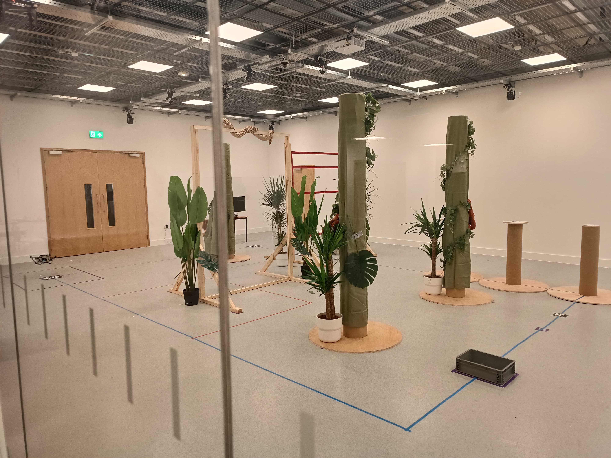

*Yeni Ufuklara Açılan Kapı*

The original contribution of this research is the development of continual learning mechanisms that enable aerial robots to improve their performance.

**İlk İzlenimler: İngiltere’ye Adaptasyon**

The original contribution of this research is the development of continual learning mechanisms that enable aerial robots to improve their performance.

