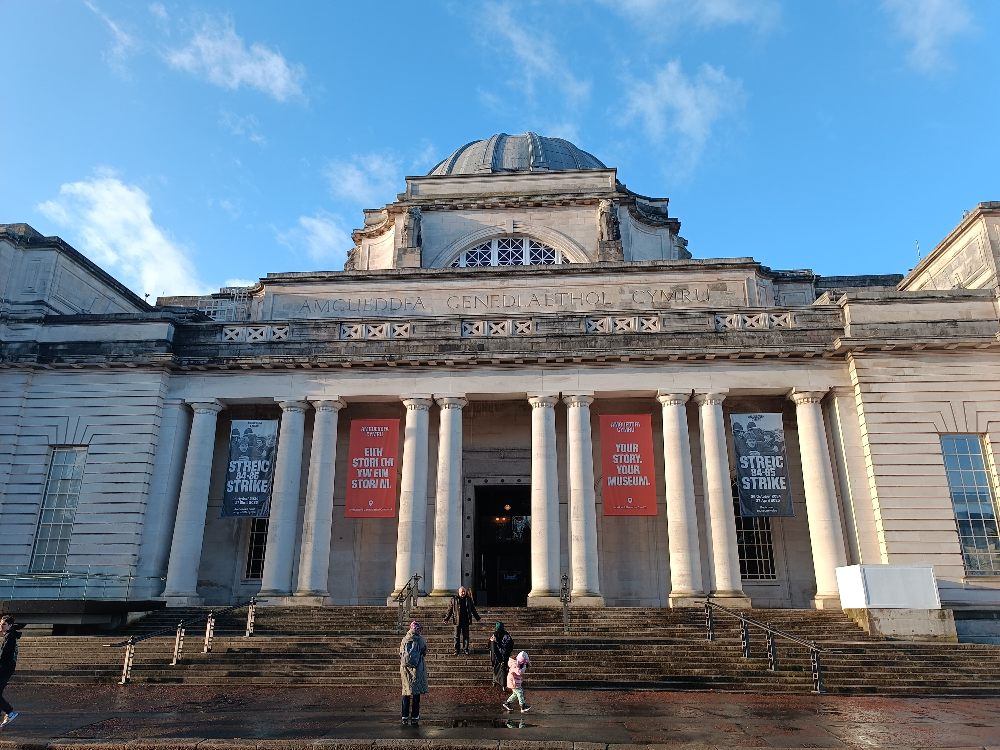
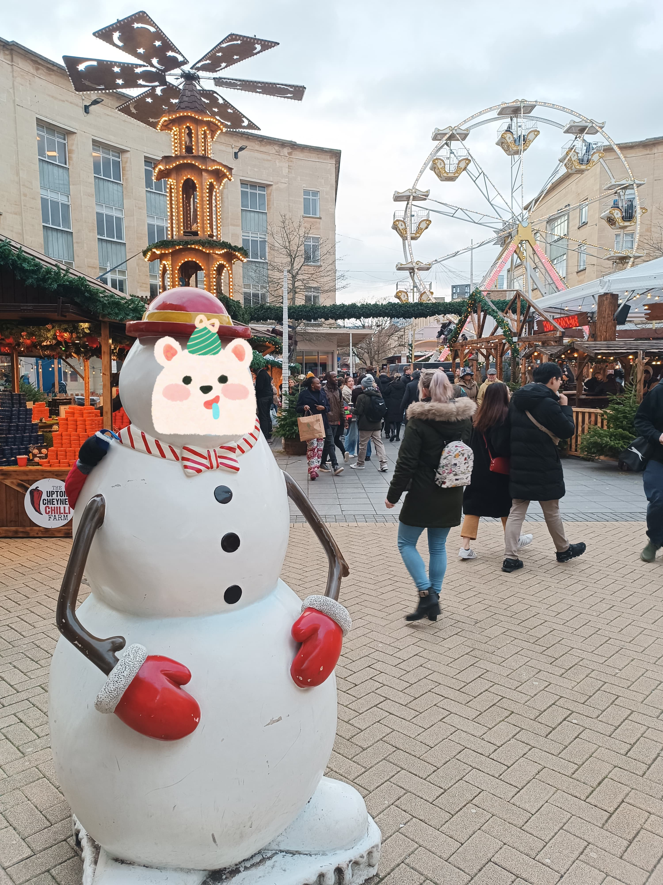
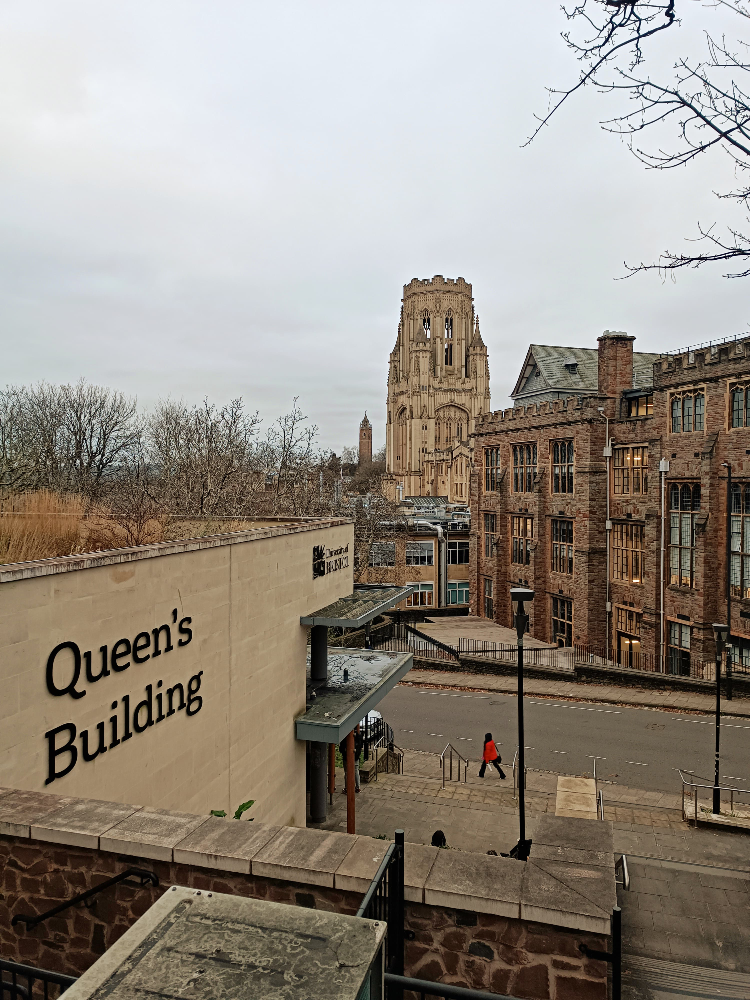
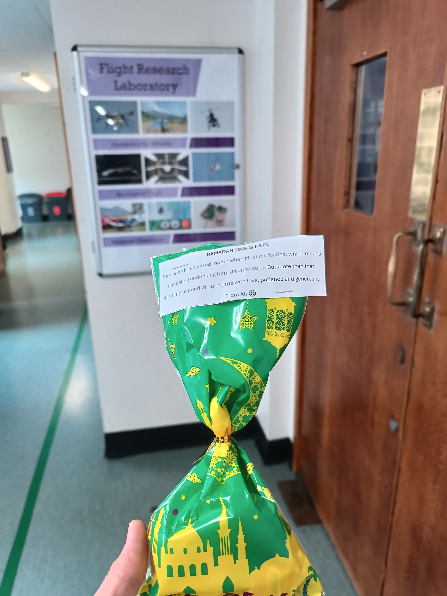

İkinci bölümle sizlerin huzurunuzdayız. Planlanan süreden biraz geç de olsa bu yazı dizisinin hem sizler hem de bizler için hoş bir akış olmasını temenni ediyorum. İlk bölümde daha çok adaptasyon ve sistem üzerine odaklanmıştık; bu bölümde ise Bristol'deki süremizi tamamlayan akademik kültürü, sosyal hayatı ve bu bir yılın bizde bıraktığı izleri paylaşarak seriyi noktalayacağız.

Microsoft'un [CrowdStrike](https://www.bbc.co.uk/news/articles/cpe3zgznwjno) güncellemesiyle beraber 8.5 Milyon cihazın etkilenmesi sonucu, 22 Temmuz 2024 tarihindeki uçuşumun ertelenmesiyle başlayan bu macera, dolu dolu bir yılı geride bıraktı.

**Aile Yaşamı ve Sosyal Uyum**

Kısa sayılabilecek bir süre içerisinde İngiltere'de bulunacak olsak da elhamdülillah bu süre zarfında bir düzenin kurulduğunu görmek ayrı bir tecrübe oldu. Bazen ataletlerimize inat konfor alanımızdan çıkarak sınırlarımızı olumlu yönde genişletmenin, yaratıcı tarafından önümüze nelerin ikram edileceğini bilemeyiz. Bu süreçte ailemizin duasını ve desteğini yakınen hissetmek her manada bize güç vermiştir. Ailemizin yanımıza kadar gelmesi, hem kendileri hem de bizim için unutulmaz hatıralar biriktirmemize vesile oldu.

<figure style="text-align: center;">
  
  <figcaption>Ailemizle beraber Galler/Cardiff gezimizden bir kare </figcaption>
</figure>

5 ve 7 yaşında yavrularımızın başka bir dilde eğitimlerine devam etmeleri bizleri oldukça mutlu etmektedir. Okulları [Severn Beach Primary School](https://www.severnbeachprimary.co.uk/) bünyesinde, İngiliz eğitim sisteminin disiplinli ama bir o kadar da teşvik edici yapısına şahit olduk. Dönemlerin altıya bölünmesi ve devam zorunluluğu gibi farklılıklara rağmen, çocuklarımız şu an okul dışında dahi vakit geçirecekleri arkadaşlıklar kurarak dil bariyerini aşmayı başardılar.

<figure style="text-align: center;">
  
  <figcaption>Yurt dışında yılın en yoğun ve ışıltılı zaman dilimi </figcaption>
</figure>

**Eğitim ve Akademik Kültür**

Bristol Üniversitesi'nin simge yapılarından **Queen's Building**, mesaimin büyük bir kısmına ev sahipliği yaptı. Buradaki akademik kültür, sadece teknik bilgi üretmek değil, aynı zamanda o bilgiyi toplumsal bir faydaya dönüştürme vizyonu üzerine kurulu. Laboratuvar ortamındaki özgürlük ve kaynaklara erişim kolaylığı, araştırmalarımızı derinleştirmek için büyük bir şanstı.

<figure style="text-align: center;">
  
  <figcaption>University of Bristol, Queen's Building: Akademik yuvamız </figcaption>
</figure>

Teknik tarafta ise otonom sistemlerin doğayla etkileşimi üzerine heyecan verici çalışmalar yürüttük. Özellikle ağaç dalları gibi düzensiz yapılara tutunabilen "tendon-driven" mekanizmaların saha testleri, teorik simülasyonların gerçek hayattaki rüzgar ve dal esnekliği gibi değişkenlerle nasıl imtihan edildiğini gösterdi.

<figure style="text-align: center;">
  
  <figcaption>Karmaşık ortamlarda otonom tutunma testleri </figcaption>
</figure>

**Toplumsal Gözlemler ve Maneviyat**

İngiltere'de geçirdiğimiz süre boyunca şehrin nabzını tutan sosyal olaylara da şahitlik ettik. Bristol halkının dünyadaki haksızlıklara karşı gösterdiği duyarlılık ve düzenlenen Filistin yürüyüşleri, adaletin evrensel bir dil olduğunu bize bir kez daha hatırlattı.

Aynı zamanda inancımızı ve kültürümüzü temsil etme noktasında da güzel anlar yaşadık. Ramazan ayının gelişiyle birlikte, içerisinde bulunduğum **Flight Research Laboratory** ekibi için küçük hediye paketleri hazırladım. Ramazan'ın paylaşma ve bereket ruhunu anlatan kısa notlar eşliğinde sunduğum bu minik ikramların, çalışma arkadaşlarım arasında kurduğumuz gönül köprülerini ne denli güçlendirdiğini görmek benim için çok kıymetliydi. Farklı kültürlerin birbirini nezaketle karşıladığı bu anlar, akademik çalışmaların ötesinde insani bir derinlik kazandırdı.

<figure style="text-align: center;">
  
  <figcaption>Flight Research Laboratory ekibi için hazırladığım Ramazan hediyeleri </figcaption>
</figure>

**Sonuç: Bir Yılın Muhasebesi**

Bu bir yıl bize sadece akademik bir unvan veya teknik bir deneyim kazandırmadı; aynı zamanda farklı bir coğrafyada aile olarak ayakta kalmanın, yeni dostluklar kurmanın ve olaylara çok daha geniş bir perspektiften bakabilmenin kapılarını açtı. Zorluklar (bürokrasi, hava durumu, başlangıçtaki belirsizlikler) elbette oldu ama hepsi birer öğrenme fırsatına dönüştü.

TÜBİTAK 2219 programı kapsamında çıktığımız bu yolculuğu, zihnimizde binlerce güzel kare ve heybemizde değerli tecrübelerle tamamlıyoruz. Bu süreçte yanımızda olan, destek veren herkese teşekkürlerimizi sunarız.

Başka serüvenlerde ve paylaşımlarda buluşmak ümidiyle, sağlıcakla kalınız.
